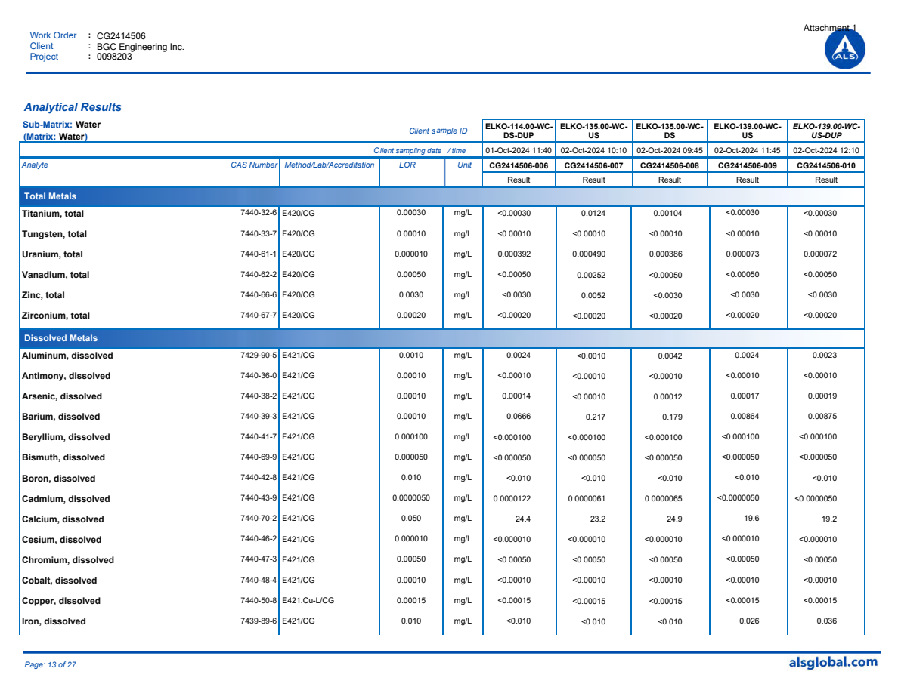
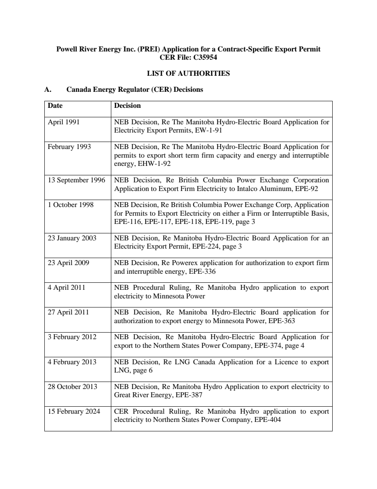
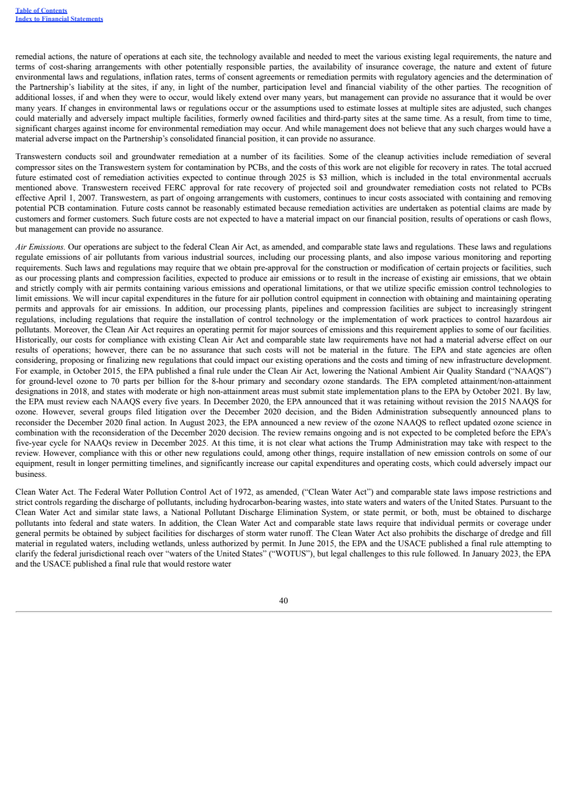
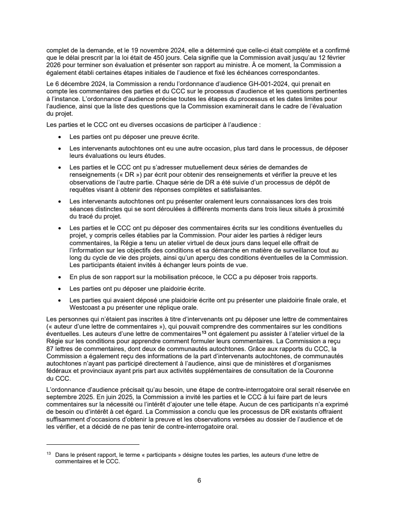
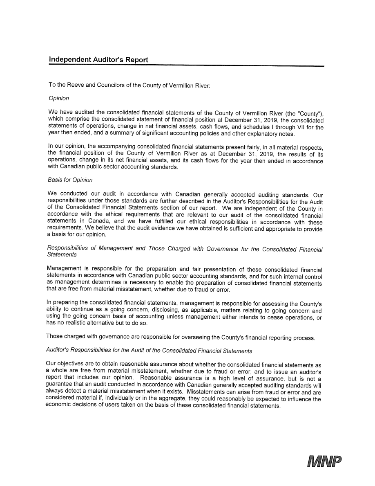
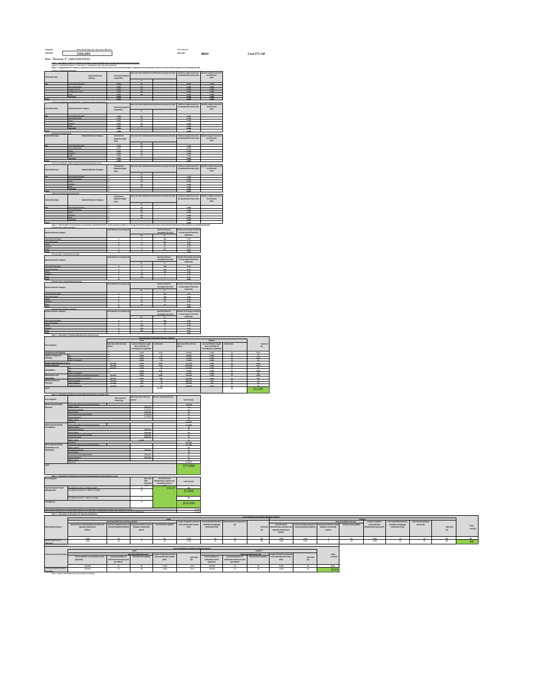
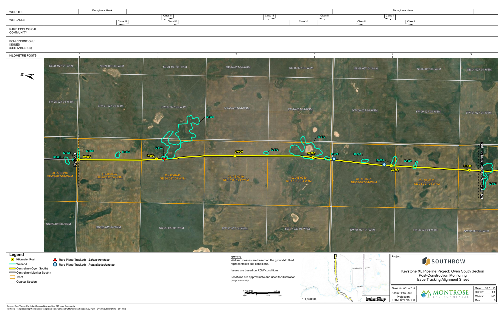
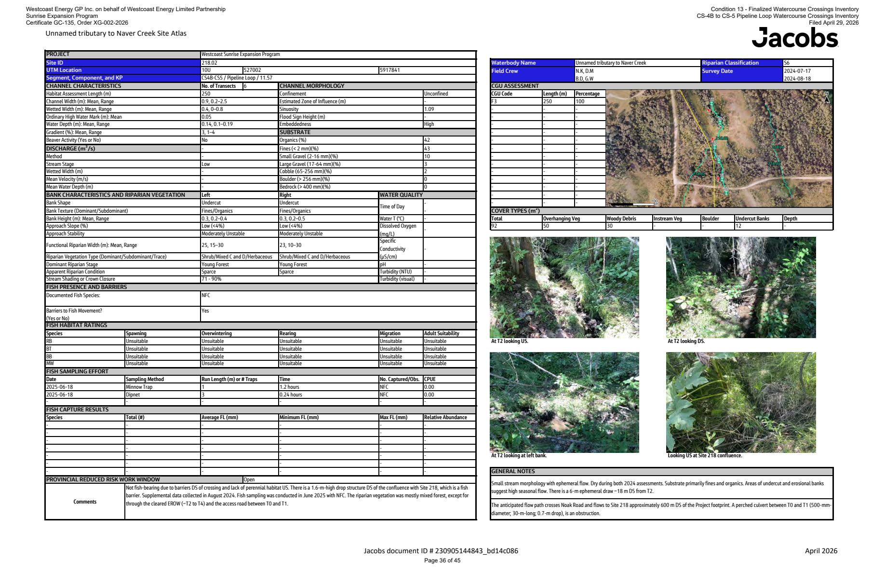

# Azure Content Understanding vs Docling

## Evaluation of the REGDOCS extraction corpus

**Evaluation date:** 12 August 2026<br>
**Azure extractor:** `prebuilt-layout`, API `2025-11-01`<br>
**Docling extractor:** `docling-standard`, Docling `2.118.1`<br>
**Decision question:** Is Docling as good as Azure for this corpus, and can it replace Azure without unacceptable loss of quality or reliability?

## Executive summary

Azure is the stronger production extractor for this REGDOCS corpus. Docling is a credible local alternative for ordinary born-digital PDFs and is sometimes better at preserving visible text, but the current Docling workflow is not an equivalent replacement. Azure is substantially faster, completes the hardest documents, retains exact page coverage, handles scanned pages more reliably, and emits a richer common schema for page geometry, sections, figures, hyperlinks, and multi-page tables.

The evidence is not uniformly in Azure's favour. Docling has no cloud service charge, keeps documents local, produces attractive Markdown tables on many uncomplicated pages, and occasionally outperforms Azure on text fidelity. Its raw structured output can also contain useful image-page text that its Markdown export omits. These strengths make Docling valuable as a secondary extractor or as the first stage in a quality-gated hybrid workflow.

The present recommendation is therefore:

1. Keep the completed Azure dataset as the canonical production analysis.
2. Continue collecting Docling results as a comparison and fallback dataset.
3. If cost reduction becomes important, test a Docling-first routing policy, but automatically send failures, timeouts, low-text scans, page-count mismatches, image-heavy drawings, and very large PDFs to Azure.
4. Do not discard the Azure artifacts based on the current Docling sample.

The headline operational results are:

| Measure | Azure | Docling | Interpretation |
|---|---:|---:|---|
| Complete current corpus | 8,213 / 8,213 | Still processing | Azure is complete; Docling is a growing sample |
| Paired PDFs measured | 5,070 | 5,070 | Like-for-like timing and page comparison |
| Paired source pages | 52,196 | 52,196 | Source PDF page count |
| Extractor page records | 52,196 | 52,037 | Azure exact; Docling projection is 159 records short |
| Documents with exact source page count | 5,070 / 5,070 | 5,020 / 5,070 | Docling differs on 50 paired PDFs |
| Processing time for paired set | 9.09 h | 40.33 h | Docling took 4.44 times as long in aggregate |
| Throughput | 5,745 pages/h | 1,290 pages/h | Measured end-to-end analysis ledger time |
| Median document time ratio | 1.0× baseline | 4.45× Azure | Docling's median relative slowdown |
| 95th-percentile ratio | 1.0× baseline | 8.91× Azure | Tail latency is materially worse |
| Common-schema sections | 69,511 | 5,070 | Docling projection currently emits one broad section per document |

The Azure service reportedly cost approximately **$500**. Using the completed Azure totals of 8,213 documents and 90,484 pages, that is approximately **$0.061 per document**, **$0.0055 per page**, or **$5.53 per 1,000 pages**. Docling avoids that Azure service bill, but its local hardware, electricity, elapsed time, storage, retries, crashes, and operator attention are not zero-cost and were not priced in this evaluation.

## Scope and method

This evaluation separates three kinds of evidence:

- **Corpus-wide operational evidence:** database status, page counts, table counts, elapsed time, attempts, errors, retries, and quarantines.
- **Automated content proxies:** Markdown and structured-output comparison against the PDF embedded text layer, using unique five-word sequences. This reduces the reward for repeated headers and duplicated hidden text.
- **Visual audit:** inspection of rendered PDF pages alongside Azure and Docling excerpts for OCR, tables, figures, maps, French text, duplicated text, and the largest file.

The automated benchmark contains **132 unique PDFs** selected across 12 overlapping cohorts:

- The 15 largest PDFs that both extractors completed.
- Ten table-heavy documents by absolute table count.
- Ten table-dense documents by tables per page.
- Ten image-heavy documents by absolute figure count.
- Ten figure-dense documents by figures per page.
- Twenty likely OCR-heavy documents.
- Twelve large French-language or French-titled documents.
- Twelve documents from each of five page-count strata: 1, 2–5, 6–20, 21–100, and 101+ pages.

The page-count probe directly opened all 5,070 paired PDFs rather than trusting either extractor's reported total. The deeper benchmark read every source page of its selected documents.

### Important limitation: there is no perfect ground truth

The PDF embedded text layer is useful for born-digital files, but it is not authoritative. Some PDFs contain no embedded text because they are scans. Others contain duplicated, malformed, or differently ordered hidden text. The report therefore treats the five-word sequence score as a **quality proxy**, not an OCR accuracy percentage.

For likely OCR-heavy documents—defined here as at least half of source pages having fewer than ten embedded tokens while the extractor output has meaningful text—the report emphasizes Azure–Docling agreement and visual inspection. A properly labelled manual transcription set would be required to calculate true character or word error rates.

Table and figure counts are also not direct accuracy scores. One extractor may represent a multi-page table as one object while another splits it into many objects. Figure counts can likewise reflect different segmentation choices.

## Largest documents and scalability

The identifier of the 986-page file is **`4647200`**, not `4647206`. Document `4647206` is a seven-page PDF.

### The 986-page stress test

Document `4647200`, *Foothills Zone 8 West Path Delivery 2023 Condition 15 Acid Rock Drainage Mitigation Plan Reports, Attachments 1–2*, is 46.4 MB and 986 pages.

Azure:

- Split it into four page ranges: 1–300, 301–600, 601–900, and 901–986.
- Returned exactly 986 unique page records with no gaps or duplicates.
- Finished in 283.95 seconds.
- Produced 1,718 tables, 404 sections, 956 figures, and approximately 4.7 MB of Markdown.
- Required four Azure range attempts, reflected in `attempt_count=4`.

Docling:

- Attempted the file three times.
- Reached the configured 1,200-second timeout on every attempt.
- Was terminated and quarantined after approximately one hour of unsuccessful compute.
- Produced no comparable completed artifact.

This is the clearest individual result in the evaluation: Azure wins the largest-document stress test by completion, speed, and recoverability.



Page 301 is a dense laboratory results table. Azure captured its work order, sample identifiers, analytes, units, detection limits, and values. Docling has no output because the document never completed.

### Other large paired PDFs

| ID | Source pages | Azure / Docling pages | Azure / Docling time | Automated text result |
|---|---:|---:|---:|---|
| `4600563` | 799 | 799 / 795 | 123 / 628 s | Azure higher sequence fidelity |
| `4647187` | 628 | 628 / 628 | 81 / 470 s | Docling slightly higher |
| `4596827` | 625 | 625 / 625 | 60 / 242 s | Both retain the text; Azure ordering score higher |
| `4646669` | 572 | 572 / 572 | 91 / 303 s | Docling higher |
| `4648189` | 514 | 514 / 514 | 68 / 201 s | Azure slightly higher |
| `4597172` | 500 | 500 / 500 | 64 / 191 s | Both retain the text; Azure ordering score higher |
| `4648190` | 499 | 499 / 499 | 78 / 226 s | Effectively tied |
| `4572347` | 482 | 482 / 482 | 71 / 299 s | Azure higher |
| `4652743` | 372 | 372 / 372 | 80 / 485 s | Azure materially higher |
| `4652521` | 368 | 368 / 368 | 27 / 461 s | Azure materially higher; Docling 17.3× slower |
| `4660247` | 333 | 333 / 307 | 54 / 338 s | Azure higher and retains exact page coverage |
| `4647074` | 313 | 313 / 313 | 88 / 413 s | Azure higher |
| `4646607` | 310 | 310 / 302 | 102 / 441 s | Azure higher and retains exact page coverage |
| `4576114` | 309 | 309 / 302 | 63 / 218 s | Azure avoids duplicated hidden text |
| `4449381` | 306 | 306 / 304 | 62 / 189 s | Essentially tied |

Across these 15 completed paired files, Azure had the higher Markdown sequence score in 11 cases, Docling in two, and two were ties. The mean scores were 0.908 for Azure and 0.852 for Docling. Comparing projected structured output rather than Markdown produced the same broad outcome: Azure won 11 and Docling four, with mean scores of 0.892 and 0.852.

The largest paired example, `4600563`, demonstrates that both systems can handle a very large born-digital legal compilation. On page 1 they captured the title, headings, dates, decisions, and table contents almost identically. Azure nevertheless finished roughly five times faster and preserved all 799 page records.



## Text quality and reading order

The results do not support the claim that Docling is uniformly worse at text extraction. Both systems are strong on conventional born-digital pages. Small and medium page-count strata contain multiple Docling wins, while Azure becomes more consistently advantageous in large, complex, table-heavy, and mixed-layout documents.

| Cohort | Documents | Azure Markdown wins | Docling Markdown wins | Ties | Mean Azure / Docling proxy score |
|---|---:|---:|---:|---:|---:|
| Largest completed | 15 | 11 | 2 | 2 | 0.908 / 0.852 |
| Table-heavy absolute | 10 | 8 | 1 | 0* | 0.794 / 0.670 |
| Table-dense | 10 | 8 | 2 | 0 | 0.523 / 0.404 |
| Figure-heavy absolute | 10 | 8 | 1 | 0* | 0.795 / 0.752 |
| Figure-dense | 10 | 8 | 2 | 0 | 0.469 / 0.360 |
| French large sample | 12 | 8 | 3 | 1 | 0.871 / 0.847 |

\*One document in each marked cohort was classified as OCR-heavy and excluded from embedded-text winner counts.

The lower absolute scores for table- and figure-dense cohorts are expected: linear text sequences cannot fully represent spatial layouts. The relative comparison remains useful, but it should not be read as “52.3% accurate.”

### Duplicated hidden text

Document `4576114` contains a duplicated or conflicting PDF text layer. On page 50, Azure produced approximately 6,952 characters in a sensible visual order. Docling's raw page projection produced approximately 17,518 characters and repeated substantial passages. This explains why simple token-count comparisons can incorrectly reward Docling for extracting “more.”



Azure is not always more complete. In `4646669`, for example, Docling aligned more closely with the embedded legal text. A production quality-control system should therefore retain the ability to compare or fall back between providers rather than treating either output as infallible.

### French text

The French cohort includes 12 larger French-language or French-titled PDFs totalling 1,219 Azure pages. Both systems performed well: the mean Markdown sequence scores were 0.871 for Azure and 0.847 for Docling. Azure won eight documents, Docling three, and one tied. The structured projection comparison favoured Azure ten to two.

On page 25 of the 499-page French Commission report `4648190`, both extractors produced fluent accented French and preserved the substantive bullets. Azure retained more of the opening paragraph and page structure, while Docling produced clean prose.



## OCR and scanned pages

The benchmark includes 20 deliberately selected likely OCR-heavy documents and 26 OCR-heavy documents across all overlapping cohorts. Because these pages lack reliable source text, Azure–Docling agreement and visual inspection are more meaningful than comparison to the empty PDF text layer.

Across the 20-document OCR cohort:

- Azure emitted 660 page records; Docling emitted 653.
- Azure found 593 tables; Docling found 463.
- Azure found 264 figures; Docling's native representation contained 540 picture objects.
- Mean Markdown five-word-sequence agreement was 0.814.
- Mean structured-projection agreement was 0.778.
- Docling took an average of 7.14 times the Azure elapsed time per document.

The reasonably high average agreement shows that Docling can OCR many scans successfully. The tail cases are important, however. The visual audit includes a scanned corporate financial statement, `4049587`, where both systems recovered substantial text but differed in reading order and table segmentation. Other benchmark pages have still more severe provider disagreement; their metrics are retained in the CSV without reproducing potentially sensitive correspondence in this public report.



The OCR cohort shows why a document-level average is insufficient: individual pages can diverge sharply even when the overall document appears successful. For any workflow where omitted evidence is consequential, low-output pages need explicit validation and fallback.

## Tables

Table quality was tested in two complementary cohorts: the ten documents with the most Azure table objects and the ten documents with the highest Azure tables-per-page density. The tests measured table counts, cell counts, empty-cell ratios, invalid coordinates, repeated cell coordinates, multi-page representation, extracted text order, and visual examples.

### Table-heavy cohort

For the ten absolute table-heavy documents:

| Measure | Azure | Docling |
|---|---:|---:|
| Table objects | 4,007 | 3,098 |
| Cells | 203,050 | 170,022 |
| Empty-cell ratio | 11.3% | 10.6% |
| Out-of-bounds cell coordinates | 0 | 0 |
| Repeated row/column coordinates | 0 | 6,896 |
| Multi-page table objects | 5 | 0 |

For the ten table-dense documents:

| Measure | Azure | Docling |
|---|---:|---:|
| Table objects | 1,330 | 374 |
| Cells | 43,388 | 46,746 |
| Empty-cell ratio | 23.4% | 17.7% |
| Repeated row/column coordinates | 0 | 5,317 |

These figures require care. Repeated Docling coordinates can represent spans or projection duplication rather than corrupted data. Azure's higher empty-cell ratio can reflect faithful preservation of intentionally blank form cells. Azure's support for multi-page tables explains why raw table counts cannot be compared as a simple score.

Visual inspection found mixed strengths:

- Azure more consistently recognized that complex spreadsheet-like pages were tables and preserved cell geometry.
- Docling often produced cleaner literal text for small, legible cells.
- On very complex worksheets, Docling sometimes flattened tables into hundreds of paragraphs or duplicated content.

Document `4656932`, page 17, illustrates the trade-off. The page is an enormous spreadsheet printed at a very small scale. Azure identified 12 table regions but made OCR errors in the headings. Docling read some headings more cleanly but treated the page largely as 758 paragraphs rather than table objects. Neither output should be trusted without validation for exact financial values.



The conclusion for tables is not simply “Azure always reads cells better.” It is that Azure provides the more dependable structured table representation for indexing and provenance, while Docling can be competitive on readable table text and may be preferable for human-friendly Markdown in simpler cases.

## Images, figures, maps, and mixed layouts

Azure exposes figures directly in the common analysis payload. Docling's native output contains pictures, but the current Docling-to-common projection deliberately emits `figures: []`. As a result, the normalized downstream dataset cannot currently use Docling figures in the same way it uses Azure figures. This is partly a projection limitation rather than purely a model limitation.

For the ten figure-heavy documents, Azure represented 2,779 figures and Docling's native payload represented 2,125 pictures. For the ten figure-dense documents, the totals were 629 and 266. Segmentation rules differ, so the numbers are descriptive rather than an accuracy ranking.

The image-heavy map document `4647207` demonstrates another subtlety. Its Docling Markdown file is empty, which initially looks like a complete failure. However, Docling's raw structured paragraphs contain map labels, kilometre posts, legal land descriptions, site IDs, and the map title. Azure's Markdown and raw output contain richer, better ordered text and structured table/figure objects, but Docling did extract useful content that its Markdown exporter omitted.



This has a direct implementation consequence: quality evaluation and normalization should not use only Docling Markdown. They should also inspect raw paragraphs and picture metadata. Conversely, the current normalizer is better aligned with Azure because it can emit figure chunks with provenance from Azure's figure objects.

Document `4662461`, page 36, combines many tables, an aerial map, and four photographs. Azure identified ten table objects and five figures on the page. Docling identified two tables in the projected common payload and no common-schema figures, although its raw text included useful notes and captions. Azure's representation is more suitable for evidence retrieval tied to page regions.



## Reliability, retries, and failure behaviour

### Docling

At the evaluation snapshot, the crash-resilient supervisor state contained:

- 5,075 successful documents.
- 5,058 first-attempt successes.
- 17 successes after retry.
- 20 failed attempts before eventual success.
- Six quarantined document IDs after three attempts each.
- Twelve timeout attempts.
- Two records not yet finalized, including the active worker.

The six quarantined IDs consist of three final segmentation faults and three repeated timeouts. Two timeout IDs, `4657424` and `4657571`, have the same SHA-256, so the six IDs represent five unique underlying files.

The observed eventual success rate among finalized Docling IDs is approximately 99.88%. That is high. The practical problem is that failures cluster among complex files:

| ID | Azure pages | Size | Docling final failure | Azure result |
|---|---:|---:|---|---|
| `4646680` | 211 | 35.5 MiB | Segmentation fault | 79.8 s |
| `4647200` | 986 | 44.2 MiB | Three timeouts | 284.0 s |
| `4648258` | 285 | 3.8 MiB | Segmentation fault | 49.8 s |
| `4657424` | 149 | 42.8 MiB | Three timeouts | 32.3 s |
| `4657571` | 149 | 42.8 MiB | Same PDF; three timeouts | 36.6 s |
| `4659381` | 297 | 3.9 MiB | Segmentation fault | 57.0 s |

Process isolation prevented these native crashes from stopping the overall run. That supervisor design is working as intended, but quarantined files still require a second provider.

### Azure

Azure ultimately completed all 8,213 current files. Successful analysis rows record 8,255 attempts: 35 documents needed more than one attempt and the maximum was four. Historical non-configuration error entries include invalid requests, service response timeouts, request transport errors, authorization errors, 404 responses, and one range page-count mismatch. Those errors were later resolved.

Azure therefore was not failure-free. Its advantage is **eventual corpus completion** and successful recovery of the largest range-split PDFs. A fair operational report should describe Azure as more resilient in this run, not perfect.

## Time, cost, storage, and operational trade-offs

### Time

On the 5,070 paired PDFs:

- Azure recorded 32,709.9 seconds, or 9.09 hours.
- Docling recorded 145,171.7 seconds, or 40.33 hours.
- Aggregate Docling time was 4.44 times Azure time.
- The median per-document ratio was 4.45; the 95th percentile was 8.91.
- Azure throughput was 5,745 pages per processing hour versus 1,290 for Docling.

These are extractor elapsed-time sums, not necessarily identical to wall-clock billing time or CPU-hours. Azure work occurs remotely while Docling consumes local compute. Both tests used the pipeline's single-worker supervisors, so these results should not be extrapolated to different concurrency or hardware without a new benchmark.

### Cost

At the user's reported Azure bill of $500:

- Average cost per document: approximately $0.061.
- Average cost per page: approximately $0.0055.
- Average cost per 1,000 pages: approximately $5.53.
- Page-rate equivalent for the 986-page stress document: approximately $5.45, although Azure billing may not allocate cost linearly in this way.

Docling's incremental cloud service charge is zero. Its true cost should include machine purchase or rental, electricity, storage, roughly 70 hours of projected successful compute for the full 90,484-page corpus at the observed paired throughput, timeout waste, monitoring, and engineering time. If these local costs total more than about $500, universal Azure is cheaper for this particular corpus. If suitable idle hardware already exists and latency is unimportant, Docling may be economically attractive.

### Storage and privacy

The current raw artifact directories are approximately 21 GB for Azure and 4.1 GB for Docling; Markdown is approximately 309 MB and 225 MB respectively. These are not yet like-for-like totals because Azure is complete and Docling is not.

Docling's strongest non-quality advantage is privacy and control: source files remain on local infrastructure and processing can continue without a cloud service dependency. Azure's advantages are managed scaling, faster completion, and richer output.

## Overall assessment

### Where Azure is better

- Completes the full corpus, including the 986-page stress test.
- Approximately 4.44 times faster in aggregate on paired documents.
- Exact source page coverage on all 5,070 paired PDFs.
- Stronger OCR tail behaviour in visually inspected scans.
- More reliable reading order on most very large and complex paired PDFs.
- Rich page words and lines, sections, figures, hyperlinks, page geometry, and multi-page table provenance.
- Better fit with the current downstream normalizer and evidence-retrieval model.
- More predictable recovery on very large PDFs through page-range splitting.

### Where Docling is better or attractive

- No Azure service charge.
- Local/offline processing and greater data control.
- Competitive text on many conventional born-digital PDFs.
- Occasional text-fidelity wins, including two of the 15 largest paired documents.
- Often clean, readable Markdown tables for simple layouts.
- Native raw output sometimes retains useful picture-page text absent from its Markdown.
- Open, inspectable pipeline with no dependency on a remote service response format.

### Where the comparison is currently biased by implementation

- Docling's common projection creates one section per document, while Azure exposes detailed sections.
- Docling figures and hyperlinks are not projected into the common schema.
- Docling page count is based on pages with projected text or tables, even though its native `pages` map may contain every PDF page.
- The Docling Markdown exporter can omit text that exists in its raw paragraphs.
- Azure and Docling table segmentation rules differ materially.

These implementation differences are themselves relevant to production readiness, but they should not all be attributed to the underlying Docling model.

## Recommendation and next steps

Azure should remain the canonical extractor for the present REGDOCS dataset. Docling is not yet “just as good” when the decision includes completeness, elapsed time, OCR tail risk, large-document completion, and downstream structure. For plain born-digital text, it is often close enough and occasionally better.

A sensible future architecture is a quality-gated hybrid:

1. Run Docling locally on ordinary PDFs where latency is not critical.
2. Validate source-versus-output page coverage, minimum text per page, conversion warnings, duplicated text, table geometry, and elapsed-time thresholds.
3. Send any failure or quality-gate violation to Azure.
4. Route known risk classes directly to Azure: very large PDFs, mostly scanned PDFs, very large image pages, complex spreadsheets, documents with prior native crashes, and deadline-critical filings.
5. Preserve both artifacts when the providers disagree materially so downstream retrieval can select the better evidence.

Before adopting that policy, improve the Docling projection so that native page count, figures, hyperlinks, headings, and raw paragraph fallback are retained. Then rerun this same evaluation. That will distinguish limitations of Docling itself from limitations of the current adapter.

For a formal publication-quality conclusion, the last missing element is a manually transcribed ground-truth set: approximately 100 pages balanced across text, OCR, tables, French, maps, forms, and poor scans. That would enable true word error rate, character error rate, table cell accuracy, and omission-rate measurements. The current report is already strong enough for an engineering decision, but manual ground truth would make model-quality claims defensible outside the project.

## Reproducibility and appendices

The evaluation package contains:

- [`metrics.json`](metrics.json): corpus totals, analyzer inventory, reliability snapshot, and cohort summaries.
- [`benchmark-documents.csv`](benchmark-documents.csv): per-document metrics for all 132 benchmark PDFs.
- [`cohort-summary.csv`](cohort-summary.csv): aggregated cohort results.
- [`large-documents.csv`](large-documents.csv): the 15 largest completed paired PDFs.
- [`paired-page-probes.csv`](paired-page-probes.csv): source and extractor page-count probes for all paired PDFs.
- [`visual-audit.json`](visual-audit.json): page-level excerpts and structure counts for rendered audit cases.
- [`assets/`](assets/): eight rendered source pages used for visual inspection.

Run the benchmark from the repository root with:

```bash
.venv/bin/python tools/evaluate_azure_docling.py
.venv/bin/python tools/render_extractor_audit.py
```

The corpus is live: Docling was still processing while this report was prepared. Re-running the evaluator refreshes paired counts and timing figures without modifying the analysis database or extraction artifacts.
